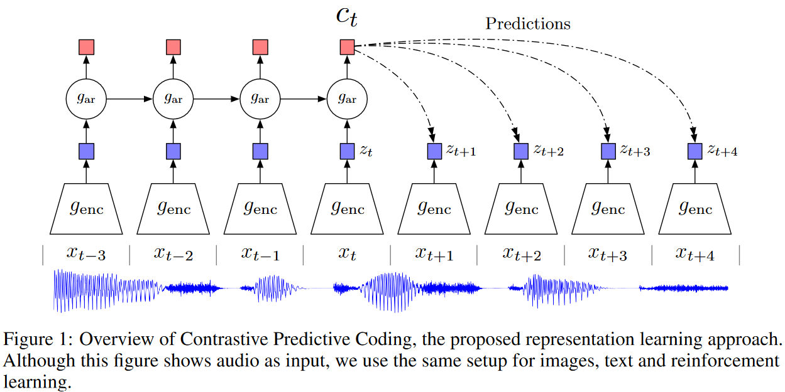

# Representation Learning with Contrastive Predictive Coding

# 使用对比预测编码的表示学习

## 甲：摘要

**监督学习**已经在很多应用方面取得了很大的成就

**无监督学习**尚未有大规模的应用，且对于人工智能来说依然是一个重要且有挑战性的问题

这篇工作：一个用于从**高维数据**中抽取**有用表示**的**普遍（universal）无监督学习方法（Contrastive Predictive Coding）**

（普遍这一点可以从这篇论文应用在音频、影像和自然语言等多方面来看到，具体在第三节）

关键：通过使用强大的**自回归模型**预测在**潜在空间**中的**未来**（“the future in *latent* space”）去**学习这样的表示**

概率对比损失（probabilistic contrastive loss）：使得潜在空间捕获的信息可以在最大的程度上对于预测未来样本有用；也使得通过使用负样本（负采样？）使得模型变得易处理（tractable）了

先前的工作聚焦于评价一个特定的模态的表示，而作者展示了他们的方法可以学习有用的表示，在四个不同的领域都表现得十分强大：演讲，图像，文本和3D环境中的强化学习

**关键词：无监督学习，概率对比损失**

## 乙：导论

（导论部分有些地方不太理解，个人认为主要是对于这块的历史不太了解的原因，有一些东西可能是之前的问题，现在已经解决）

### 壹：过去的方法与存在的问题

使用**分层可分模型（“layered differentiable models”）**从有标签的数据中以端到端的方式（“end-to-end fashion”）学习高级表示是人工智能迄今为止最大的成就

（？没见过这里的分层可微模型，有可能是说包含输入层输出层隐藏层，并且可以进行梯度传播的神经网络模型，端到端应该说的就是从输入到输出，中间不停顿，这个称呼的来源疑似是因为以前还出现过需要手动设计或选择中间表示或特征的方法）

存在问题：数据效率，稳健性（鲁棒性，robustness），泛化能力

（这篇论文中提到特征的时候一般会说“induced feature”，之前看的一般都是“extracted feature”）

### 贰：作者的总结与他们的看法

作者认为改善表示学习需要一些**并不专门针对于解决某些问题的特征**（“features that are less specialized towards solving a single supervised task”），并且因此无监督学习是更稳健更通用的表示学习的重要阶段

（作者还举了几个例子，但是没看懂为什么改善表示学习需要一些上面写的特征）

但虽然它很重要，不过目前没有类似于监督学习的重大突破，现在仍然没有办法从原始观察数据中建模高级表示，理想的表示形式也并不总是清晰可见，也不能确定是否可能在没有额外监督或专门化到特定数据形式的情况下学习这样的表示形式

接下来，作者提了一下在这个领域一些经典的策略和他们关于为什么这些策略能够成功的看法。

经典的策略：预测未来，缺失或上下文信息

它们的来源：用于数据压缩的信号处理中最古老的技巧

生物学角度：预测编码理论表明大脑在各种抽象层次上预测观察结果

最近的工作：通过预测相邻单词学习词表示；通过从灰度图预测颜色或者图片补丁的相对位置（？）

作者的看法：作者假设这些方法能够成功的原因是，用于预测相关值的上下文常常有条件地依赖于相同的共享高级潜在信息（“the context from which we predict related values are often conditionally dependent on the same shared high-leved latent information”）

（这论文里面从句和修饰词也太多了）

通过把这视为一个预测问题，作者自动推断出（automatically infer）这些特征对表示学习很有兴趣（these features of interest to representation learning）

（没读懂“自动推断”和“感兴趣”是什么意思）

### 叁：提出的方案

#### 一、压缩数据

作者把高维数据压缩成了一个更加紧致的潜在嵌入空间，这样条件预测对于模型来说就更容易了

#### 二、自回归模型分步预测

作者在这个潜在空间中用了一个强大的自回归模型，将在未来的预测变成了很多步（make predictions many steps in the future）

（一直不太懂这篇论文中反复说的in the future里面的future是什么意思）

#### 三、应用噪声对比估计（Noise-Contrastive Estimation）

在损失函数中使用了噪声对比估计，和在自然语言模型中学习词语嵌入时候的使用方式相同，让整个模型可以端到端地训练

作者将这个模型（CPC）广泛应用到了不同的数据模态，图像、演讲、自然语言和强化学习

相同的机制在各个领域都学到了有趣的高级表示，比其他方法表现好

## 丙：对比估计编码（Contrastive Predicting Coding）

首先介绍怎么想的，其次介绍CPC的架构，然后回解释基于NCE的噪声估计，最后会讨论CPC的相关工作

### 壹：动机与直觉

#### 一、直觉

应该学习那些编码了**高维信号中不同部分之间的潜在共享信息的表示**；丢弃**低级信息**和**更加局部的噪音**

在时间序列和高维建模中，使用下一步预测（next step prediction）的方法利用（发掘了）了信号的局部光滑性

（？不知道这里说的下一步方法是什么，也不太清楚这句话和下一句话之间的逻辑关系，可能是想说在时间序列和高维建模中只预测临近的一点点东西，而并没有对于距离更远的东西进行联系和预测？）

当预测未来更长时间的时候，共享信息的数量大大降低了（？为什么），并且模型需要推断更加全局的结构

这些跨越多步的“慢特征（slow features）”通常更加有趣

例如，语音中的音素和语调，图像中的对象，或书籍中的故事情节

（我的想法是作者应该就是认为之前都只用每个信息附近一点的信息，但是没有将每一处的信息和离它相对远一点的信息联系起来，更没有从全局的角度去提取这些信息

但这些信息又常常是有用的，比如一本书中情节常常是前后关联的，这是非常有用的信息，可是具体到某一句话某一个字的话就提取不到这样的信息了

比如如果只聚焦于局部的话模型可能可以学到词语“红色的”附近一般是“苹果”、“太阳”等词语，但是却学不到例如在全局上“红色的苹果”是“成熟”、“丰收”象征，而这两个词可能又和“雨水”“光照等原因有关”

因为可能书的第一章写了“丰收”原因，即充足的“雨水”和“光照”，第二章写了“丰收”的结果即“红色的苹果”，这两者是有关联的，但是如果只聚焦在一两个词语附近的话就提取不到）

#### 二：挑战

像均方误差和交叉熵这样的单峰损失（unimodal losses）不是很有用

并且常常需要强大的条件生成模型（conditional generative model）去重建数据中的每一个细节

但是模型在对数据$x$的关系进行建模的时候要进行非常密集的计算（“computationally intense”）且浪费容量，通常会忽略上下文$c$

举例：图片有几千bits的信息，而像类别标签这种高级潜在变量包含少得多的信息

作者认为这说明直接对于$p(x|c)$建模对于抽取$x$和$c$的共享信息这样的目的也许不是最优的选择

基于这点，作者在预测未来信息的时候用一种**能够最大化保存原始信号$x$和$c$之间的交互信息（mutual information）的方式**，这种方式通过非线性学习映射（via non-linear learned mappings）把目标$x$（未来）和上下文$c$（现在）编码进一个紧致分布的向量表示（compact distributed vector representation）（？不明白什么叫做紧致分布的）

$$
I(x;c)=\sum_{x,c}p(x,c)log\frac{p(x|c)}{p(x)}\tag{1}

$$

作者认为，通过最大化编码表示之间的交互信息，他们提取了输入共有的潜在基础变量，这些表示被输入信号之间的MI（？）所控制（bounded）

### 贰：对比预测编码

如Figure1所示

作者在这里从一个$x_t$作为切入口去解释整个过程的进行

对于某个选定的时刻中的信息，它可能是一小段的某个信息，记为$x_t$，这里首先使用一个**非线性编码器**$g_{\mathrm{enc}}$去对于这一段进行编码，相当于特征提取

即这个编码器把观测（observation）$x_t$的输入序列映射成一个潜在表示$z_t$，这个过程记作$z_t=g_{\mathrm{enc}}(x_t)$，可能会有一个比较低的时间分辨率（temporal resolution，这里说时间分辨率的原因应该是因为这个输入是一个语音输入）

我判断$g_{\mathrm{enc}}$预先对于所有分段信息都这样编码，每一块$x_t$都生成一个$z_t$，而不是随序列移动

对于生成的$z_t$，将其放入一个**自回归模型**$g_{\mathrm{ar}}$（这里我认为应该是随序列移动的，具体的可以看下面是如何比对的），我们对于每一个具体的块的潜在表示$z_t$，我们注意的都是它和它前面所有的潜在表示放入$g_{\mathrm{ar}}$后生成的东西，即我们可以想象是

$$
x_1\xrightarrow{g_{\mathrm{enc}}}z_1\xrightarrow{g_{\mathrm{ar}}}c_1\\
x_2\xrightarrow{g_{\mathrm{enc}}}z_2+c_1\xrightarrow{g_{\mathrm{ar}}}c_2\\
x_3\xrightarrow{g_{\mathrm{enc}}}z_3+c_2\xrightarrow{g_{\mathrm{ar}}}c_3\\
...\\
x_t\xrightarrow{g_{\mathrm{enc}}}z_t+c_{t-1}\xrightarrow{g_{\mathrm{ar}}}c_t

$$

这样每一个时刻的信息都和前面的信息联系起来了，所以这里文中的表示是$c_t=g_{\mathrm{ar}}(z_{\le t})$

作者再次重申他并不是用生成模型$p_k(x_{t+k}|c_t)$去直接预测未来的观测$x_{t+k}$

取而代之的是，作者建模了一个**密度比例（density ratio）**，这个密度比例保留了在equation 1中出现的$x_{t+k}$和$c_t$之间的交互信息，定义如下

$$
f_k(x_{t+k},c_t)\propto \frac{p(x_{t+k}|c_t)}{p(x_{t+k})}\tag{2}

$$

这里的密度比例$f$可以是不归一的（unnormalized）（？在文中的描述是“Note that the density ratio
$f $ can be unnormalized（does not have to integrate to 1）”）

作者的描述是“Although any positive real score can be used here, we use a simple log-bilinear model:”，其中不太清楚“positive real scorerea”什么意思，感觉上这里的“score”是分数，翻译过来可能就是表示某种评价，但总之作者应该是想表达这个总之是正的就行，不过这里他们用的是一个简单的对数双线性型模型，如下

$$
f_k(x_{t+k},c_t)=\mathrm{exp}\bigg( z^T_{t+k}W_kc_t\bigg)\tag{3}

$$

作者在这里说类似于$W_k^Tc_t$是一个用于预测的线性变换，并且每一步$k$用到的线性变换$W_k$都不一样，但是这里我不太理解为什么在上面公式中没有用$W_k$的转置而是直接使用了$W_k$，作者还提到非线性网络或者循环神经网络（recurrent neural network）都可以

这里有些地方看不懂的原因应该主要是对于自回归模型不太熟悉（autoregressive model），不过目前只要知道它是一种时间序列模型，用于预测时间序列数据中的未来值。在自回归模型中，当前时间点的观测值被认为是过去时间点的值的线性组合，加上一个随机误差项。换句话说，自回归模型假设当前观测值与之前的观测值之间存在某种自相关性。

### 叁：InfoNCE Loss和交互信息估计（mutual information estimation）

编码器和自回归模型都被训练去一起优化一个基于NCE的的损失，在这里作者将其称作InfoNCE，需要被优化的损失如下

$$
\mathcal{L}_\mathrm{N}=-\mathop{\mathbb{E}}\limits_{X}\bigg[\mathrm{log}\frac{f_k(x_{t+k},c_t)}{\sum_{x_j\in X}f_k(x_j,c_t)}\bigg]\tag{4}

$$

其中，$X=\{x_1,...x_N\}$是$N$个随机采样，这些采样中包含来自于$p(x_{t+k}|c_t)$的一个正样本和来自于所给出的分布（“‘proposal’distribution”）$p(x_{t+k})$中的$N-1$个负样本

下面，作者解释了为什么优化这个损失可以使得我们可以用$f_k(x_{t+k},c_t)$来估计equation 2中的密度比例，解释的过程主要依赖于下面这个方程

$$
\begin{aligned}
p(d=i|X,c_t) &= \frac{p(x_i|c_t)\prod_{l\neq i}{p(x_l)}}{\sum_{j=1}^Np(x_j|c_t)\prod_{l\neq j}p(x_l)} \\
&= \frac{\frac{p(x_i|c_t)}{p(x_i)}}{\sum^N_{j=1}\frac{p(x_j|c_t)}{p(x_j)}}\tag{5}
\end{aligned}

$$

作者认为，在equation 4中的损失是一个类别交叉熵（categorical cross-entropy），这个交叉熵损失是关于正确分类正样本的，其中$\frac{f_k}{\sum_Xf_k}$是模型的预测，下面用$p(d=i|X,c_t)$表示这个损失的最优概率（“the optimal probability”），其中$[d=i]$表示样本$x_i$是’正‘采样（'positive' sample），这样，上面的公式表示的就是采样$x_i$从条件分布$p(x_{t+k}|c_t)$而不是给出的分布$p(x_{t+k})$采到的概率
