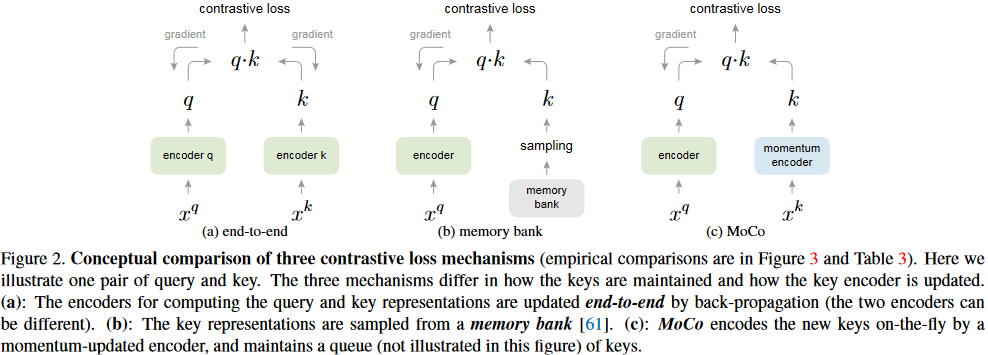
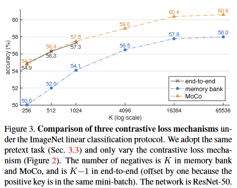
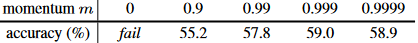

# Momentum Contrast for Unsupervised Visual Representation Learning (MoCo) (version 1)

# 用于无监督视觉表示学习的动量对比

## 甲：导论

### 壹：无监督学习与有监督学习&自然语言处理和计算机视觉的差异和原因

无监督表示学习在自然语言处理中尤为成功：GPT和BERT
但监督预训练在计算机视觉中还是占了主导地位，这里无监督的方法并没有跟上
原因：语言任务有着离散的信号空间，便于建立标记化的字典；而对比来看计算机视觉来说原始信号在一个连续的高维空间里，并且这种字典并不适合人类沟通

### 贰：无监督学习最近的研究与它们中使用的方法

都是在将与`对比损失（contrastive loss）`有关的方法应用到`无监督视觉表示（unsupervised visual representation）`中
（监督学习是在有标注的数据集上，很贵
无监督学习是在没有标注的数据集上，很便宜但是不确定能保证效果
因此最好的方法是先进行预训练而后进行微调（“Unsupervised Pre-train&Supervised Fine-tune”）
这个过程可以被解释为把参数从**一张白纸**训练到**初步成型**，而后从**初步成型**训练到**完全成型**
其中训练到初步成型的东西叫Visual Representation
zhuanlan.zhihu.com/p/382763210）

虽然方法不同，但是都可以被认为是在建立一个`动态字典（dynamic dictionaries）`：

$$
数据（图像或者补丁）\xrightarrow{\text{采样生成}} 字典中的“键”或标记\xleftarrow{\text{用于表示}} 编码网络

$$

$$
data(image\ or\ patch)\xrightarrow{\text{sample}} keys(tokens)\xleftarrow{\text{represent}} encoder\ network

$$

无监督学习训练编码器去进行字典查找（dictionary look-up）：

$$
匹配键 \xrightarrow{\text{相似}} 编码序列 \xleftarrow{\text{不相似}} 其他

$$

$$
matching key \xrightarrow{\text{similar}} encoder\ “query” \xleftarrow{\text{dissimilar}} others

$$

学习的过程：最小化对比损失

### 叁：本篇论文的直接想法与以往方法的不足

从上面作者对于以往论文中使用方法的总结出发，作者认为（或者说他们假设），**需要建立的字典**应该有如下特征：
一、大
二、在训练中在它们发展的时候具有一致性（“consistent as they envole during training”）

原因如下：
一、直觉上来讲，大字典可以更好地采样底层的连续高维空间
二、字典中的键应该用相同或者相似的编码器表示，这样它们和序列的对比才能是一致的（？）

现存方法的不足：
现存的使用对比损失的方法都在这两者中的其一有缺陷

## 乙：相关工作

无监督/自监督学习方法涉及到的两个方面：前置任务/代理任务（pretext tasks）和损失函数（loss function）
MoCo聚焦于损失函数方面

### 壹：损失函数

#### 一、常见的损失函数

常见的用于度量模型的预测值和固定目标（*fixed* target）之间的差异的损失函数定义：
通过$L_1$和$L_2$损耗重建输入像素
通过交叉熵（cross-entropy）或基于边界的损失（margin-based losses）将输入分类为预先定义好的不同类别
其他等等

#### 二、对比损失（contrastive losses）

对比损失度量表示空间中的样本对的相似性
特点：

##### 可动态变化

常见损失函数中的目标是固定的，即标注好的样本。而在对比损失函数中目标值不是固定的，通常来说就是其他的样本（负样本，即除了待编码样本以外的样本）

##### 可被网络表示定义

即可以被网络计算出来的数据表示定义（can be defined in terms of the data representation computed by a network）
对比学习是最近几个无监督学习的核心

#### 三、对抗损失（adversarial losses）

对抗损失度量概率分布之间的差异
在无监督数据生成领域它是一个非常广泛非常成功的技巧
用于表示学习的对抗方法[15, 16]
生成对抗网络（GAN）和噪声对比估计（NCE）[28]的关系[24]

### 贰：前置任务/代理任务（pretext

在有损坏的情况下回复输入（类似于掩码后猜测原位置标记）
去噪自动编码器（denoising auto-encoders），文本自动编码器（context auto-encoders），频道交叉自动编码器（cross-channel auto-encoders） (colorization) [64, 65]. Some pretext tasks form pseudo-labels by,
等等等等，在这里不详细写了

### 叁：对比学习和前置任务的对比

暂时略过

## 丙：方法

### 壹：作为字典查找（dictionary look-up）的对比学习

对比学习和其最近的发展可以被理解为针对一个**字典查找**任务训练编码

$$

$$

### 贰：动量对比

#### 一、作为队列的字典

#### 二、动量更新

#### 三、和之前的机制的关系

### 叁：前置任务

#### 一、技术细节

#### 二、批次重洗（Shuffling BN.）

## 丁：实验

### 零：实验设置

#### 一、ImageNet-1M(IN-1M)

ImageNet训练集

有1000个类别约128万张图像，一般叫做ImageNet-1K，这里用数量而不是用种类（就是用1M而不是用1K）称呼是因为种类并没有被无监督学习开发出来（？没懂，原文是“classes are not exploited by unsupervised learning”）

**特点**：种类分布均衡，它的图像通常包含物体的标志性视角（iconic view of objects）

（意思应该就是说一张图片中物体的占比很大，并且很典型，比如就不会出现一张图像中有各种各种的东西，模型抓不到重点；也不会出现拍一张动物屁股的图片，模型分辨不出来到底是猫还是狗）

#### 二、Instagram-1B(IG-1B)

来自Instagram

有约1500个标签（hashtags）的约10亿（9亿4千万）图像，这些标签是根据ImageNet种类来的（？“related to the ImageNet categories”）

**特点**：相比于ImageNet-1M来说，这个数据集未经过筛选（uncurated），并且有一个真实世界的长尾不均衡分布（“a $\mathit{long-tailed}$, $\mathit{unbalanced}$ distribution of real-world data”），这个数据集同时包含标志性物体（iconic objects）和景观级图片（scene-level images）

#### 三、训练

##### 优化器（optimizer）：SGD

权重衰减（weight decay）为0.0001

SGD动量：0.9

（这里的这个动量应该就是在前面提到的MoCo中包含的两个编码器共享权重时字典编码器的权重中查询编码器占的比例）

##### IN-1M

迷你批次为256

8 GPUs

初始学习率为0.03

200轮次，学习率在120轮次和160轮次时乘0.1

用ResNet-50训练了约53个小时

##### IG-1B

迷你批次为1024

64 GPUs

初始学习率为0.12

每62.5k迭代（64M张图像）后学习率指数下降0.9（？“a learning rate of 0.12 which is exponentially decayed by 0.9× after every 62.5k iterations (64M images)”），1.25M次迭代（约为IG-1B轮次的1.4倍（？没看懂））

用ResNet-50训练了约6天

### 壹：线性分类协议（Linear Classification Protocol）

作者首先在**冻结特征**上验证了**线性分类**（“$\mathit{linear}$ classification on *$\mathit{frozen}$* features”）

（因为无监督学习无法和自然语言匹配，因此只是相当于一个预处理，所以说验证一个无监督学习学出来的东西的好坏就是看它提取了什么样的特征出来。要想进行这样的验证，就是得把它提取出来的特征喂给其他的模型，比较其他模型通过吃它吐出来的东西能够学得怎么样）

这一节中，作者展示的是在**IN-1M**上进行的**无监督预训练**

而后将特征冻结

（用这些冻结的特征）训练一个**监督线性分类器**

分类器是一个**带有softmax的全连接层**

这个分类器的训练是在一个**ResNet**的**全局平均池化特征**上的（？“on the global average pooling features of a ResNet,”），共100个轮次

**结果**：在ImageNet验证集上达到了1-crop，top-1的分类准确率

对于这个分类器，作者使用了一个网格搜索

找到了最优的初始学习率是30（？）

权重衰减是0（？），和文献[56]中提到的一样（等会儿看一下）

这些超参数对于本小节中呈现的所有消融实验都表现出一致的良好性能

这些超参数值意味着特征分布（例如，大小）可能与ImageNet监督训练的特征分布（？）存在显著（？）不同，这是将在第4.2节重新讨论的问题（“These hyper-parameters perform consistently well for all ablation entries presented in this subsection. These hyper-parameter values imply that the feature distributions (e.g., magnitudes) can be substantially different from those of ImageNet supervised training, an issue we will revisit in Sec. 4.2.”）

#### 一、消融：对比损失机制

在这个实验中，作者对比了Figure2中描述的3种机制

实验设置：

作者将它们植入到相同的3.3节中提到的前置任务中

用了InfoNCE的同一种形式作为对比损失函数（方程(1)）

（控制变量）

结果如Figure3所示

三种机制都是$K$越大越好

在[61, 56]中使用记忆库机制的时候也观察到相似的趋势

这些结果支持了作者建立一个更大的字典的动机（猜想）

（看来要多看论文才能写出好的论文……这里加入了其他论文的观点可以更好地相互验证并且更好地说明这篇论文中做实验的结果，且将一篇论文中的观点拓展到了其他机制）

##### 端到端机制

$K$比较小的时候结果和MoCo相似

但是**字典大小被迷你批次大小限制住了**（一个高端机器（8 Volta 32GB GPUs）所能提供的最大迷你批次是1024）

（与下面的记忆库机制形成对比）

**更重要的是大迷你批次训练是一个尚未解决的问题[25]**：

必须使用线性学习率缩放规则（linear learning rate scaling rule）[25]，不然的话对于1024迷你批次来说准确率会下降约2%

但是使用大迷你批次优化更难，且即使内存足够，趋势是否可以推广到更大的$K$值也是可怀疑的

（指出了端到端机制的缺点：首先是由于其依赖于迷你批次的大小，因此字典不能扩大（不能大于字典）；其次即使我们尝试使用更大的迷你批次，由于其必须使用线性学习率缩放规则（不然准确率会下降），因此（在这个规则下）优化一个大的迷你批次会很难；最后即使能够记忆库本身够大，这种方法也未必能推广到更大的负样本规模（即$K$），而前面论证了负样本规模越大越好。很充分的论证）

##### 记忆库机制

**可以支持更大的字典大小**

但是比MoCo在准确率上低了2.6%

与猜想相同：原因是记忆库中的密钥来自于以往的轮次中、差异很大的、不一致的编码器

最后提了一嘴这里可以看出作者的植入比[61]中的更好

#### 二、消融：动量

这里展示了都采用了MoCo算法但动量值不同的ResNet-50的准确率

负样本大小$K$是4096

结果如下图

#### 三、和之前结果的对比

之前的无监督学习模型在模型大小这方面的差异非常大，因此为了公平全面的比较，

### 转移特征

无监督学习的一个主要目标是学习可转移的特征（“features that are transferable”）

# 读后感

读完这篇论文后对于无监督学习确实有了更深刻理解

## 学习分为有监督和无监督

学习分为有监督和无监督，其区别无非在于“是否有人对于模型的正误进行判断”

### 监督学习

就有监督学习来说，对于图像分类的判断标准就是人的自然语言和图像匹配，让机器学会这种匹配关系；对于图像分割这个判断标准无非是精确到了像素级别，判断每个像素应该是属于什么类别，因此判断标准是人预先分割好的图像，是人根据自己的想法对于图像中的信息和图像的匹配

这个过程我们可以把它拆分成三个步骤

一个是机器去提取图像的特征（卷积层），我们可以把提取到的特征理解为机器自己的“语言”，这就是机器学习到的东西

另一个是机器用它学到的特征拿去和给它的判断标准匹配（全连接层），在这里机器在判断它学到的东西和人的判断标准差得多大

最后是根据这个差距去优化前面两个过程涉及到的参数，全连接层进行一次判断，根据这时机器的判断和正确的标签相差多少，去优化卷积层和全连接层

优化的过程总得来说全都是想缩小机器的判断和人的判断标准的差距，这个差距的体现就是所谓的损失函数，损失得越多就说明差得越大（这里多的判断就是函数的具体细节了）

总结：在一次训练中，各种卷积层就是提取特征的过程，全连接层就是对于特征判断的过程，最后我们需要根据这两个过程中出现的差距对于这两个过程中涉及到的参数进行优化

### 无监督学习

既然监督学习的定义里规定了其就是一种根据人的监督（即包含人的判断标准）而设置的学习方式，无监督学习中就是没有（或极少）人的监督的方式，这里就不可能提供任何判断标准

因此非常自然的想法就是：它一定和自身是最相似的
