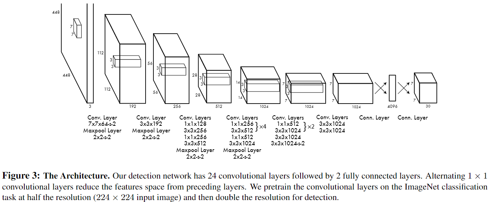

# You Only Look Once: Unified, Real-Time Object Detection

# YOLO：统一的实时物体检测

## 甲：摘要

以往的目标检测：重新利用（repurpose）分类器进行检测（repurpose一个单词是重新利用的意思，这里可能指的是之前将检测和分类分成两个部分进行）

本项工作：将目标检测构建为一个单一回归问题，旨在空间上分离边界框和相关类别概率（associated class probablities）

方法：使用**单一神经网络**，在**一次评估**中直接从**整张图像**中预测边界框和类别概率

特点：单一神经网络-可直接在检测表现上实现**端到端的优化**

优势：快，可泛化

劣势：会产生更多的定位错误，但并不太会错误预测背景中的错误正例（false positives）

## 乙：导论

作者提了一下人类的识别，快速且准确；而后说了一下他的想法，这种识别可以用到自动驾驶和机器人系统

### 壹：现有的方法以及其不足

#### 一、现存的方法（以DPM为例）

为指定目标使用一个分类器（“take a classifier for that object”不太清楚这里的意思是不是对于给定目标要用特定训练好的分类器）

而后在测试图像的不同的位置和尺度上评估它

举例：deformable parts models（DPM），使用滑窗方法，分类器在整张图像上在以同样区分的位置上跑

即把整张图像检测一遍

#### 二、稍早的方法（以R-CNN为例）

首先用区域提议法（region proposal method）生成一张图像中可能的边界框

而后在这些边界框上跑一个分类器

分类后，使用后处理（post-processing）去修正边界框，消除重复检测，重新基于场景中的其他目标评分边界框

评价：缓慢且难以优化，因为其必须被部分训练

### 贰：作者的方法以及其优势

#### 一、方法

将目标检测重建构建为一个单一回归问题，直接从图像像素到边界框坐标和类别概率

#### 二、优势

##### 结构简单

一个卷积神经网络，同时预测多个边界框和这些边界框的类别概率

整张图片训练，直接优化检测表现

##### 快

作者说由于他们把问题重建构建为一个单一回归问题，所以不需要复杂的pipeline了（这里应该是重点，要搞清楚为什么重新构建问题可以去掉复杂pipeline，主要应该是看问题的视角不一样会导致方法的不同）

基础网络45帧每秒，加快版本150帧每秒，因而进一步可以用于实时视频检测

##### 全局信息处理

之前的方法，比如R-CNN，是在图像的每一个部分进行滑动，因此它其实并不是同时接收整张图象，同时在对于部分进行检测后也并没有把前一个部分和后一个部分联系起来的部分，因此它并没有对于整张图像进行学习的能力，类似于在地图上用放大镜找东西

而YOLO使用一整张图像作为输入，神经网络对于其进行学习，因此它就能学到一张图像中的不同的东西的区别，拥有了联系每个图像的不同部分的能力

用作者的话来说，就是YOLO暗含地编码了关于类别和它们的表现的上下文信息（“implicitly encodes contextual infomation about classes as well as their appearance”）

YOLO比顶级的R-CNN方法Fast R-CNN犯的背景错误少一半

##### 泛化能力

这里原因不明，可能就是上面提到的整张图片输入的原因，总之作者说在自然图像上进行训练并在艺术品上进行测试的时候（可能是一种测试方法？），它比DPM和R-CNN等顶级检测方法要优秀，并且应用于新领域的时候不太可能会出现故障

#### 三、劣势

作者还是提了一嘴劣势，就是YOLO可以快速识别，但是精准定位不太行

## 丙：一致探测

作者把目标探测的几个不同部分统一在单一神经网络中（这个网络的结构应该就是下面的重点）

它们的网络使用来自整张图像的特征去预测每一个边界框

与此同时在所有类别中预测所有边界框的归属

### 零：概述

#### 一、切分网格胞

将输入图像切分成$S\times S$个网格，如果目标中心落入某个网格胞（grid cell），那么那个网格胞就负责探测那个目标

#### 二、网格胞预测

每个网格胞预测$B$个边界框和这些框的置信分数（confidence score），这些置信分数反映了模型对于该框包含一个目标的信心，也反映了它认为框就是它的预测的准确率，置信分数定义如下

$$
\mathrm{Pr(Object)*IOU^{truth}_{pred}}

$$

如果胞中没有目标存在，那么置信分数就是应该是0，否则的话我们希望置信分数等于预测框和真实值的交并比（交叠比，intersection over union，IOU）

每个网格胞还预测$C$个条件类别概率（conditional class probabilities）$\mathrm{Pr(Class_i|Object)}$，这些概率在包含了一个目标的网格胞中是有条件的（？没看懂，原文是“These probabilities are conditioned on the grid cell containing an object.”也可能是“这些是在包含一个目标的网格胞上的条件概率”）

每个网格胞上作者只预测一个类别概率集，不管框$B$的数量有多少

并且我们可以有

$$
\mathrm{Pr(Class_i|Object)*Pr(Object)*IOU^{truth}_{pred}}=\mathrm{Pr(Class_i)*IOU^{truth}_{pred}}\tag{1}

$$

这个公式给了我们每个框精确到类别的置信分数

这些分数同时编码了框中出现的类别的概率和预测框有多好地符合目标

#### 三、边界框预测

每个边界框（不过这里目前还没说是预测框还是真实框，感觉上来说应该是之前提到的每个网格胞中预测的$B$个预测框）包含以下5个预测值：$x,y,w,h$和置信，其中

$(x,y)$坐标代表的是框的中心相对于网格胞的边界

width和height是相对于整个图像的预测值

置信预测代表了预测框和任何真实框之间的IOU

### 壹：网络设计

### 贰：训练

卷积层在ImageNet1000-class竞赛集上进行了预训练，预训练用了Figure3中的前20个卷积层，后面跟着一个平均池化层和一个全连接层，原文为“For pretraining we use the first 20 convolutional layers from Figure 3 followed by a average-pooling layer and a fully connected layer.connected layer.”，这里首先**没明白为什么只用前20个卷积层**，前20层的话就是到第5个块的上面的×2的两层，其次没明白说的跟着一个平均池化层和一个全连接层是什么意思，全连接层肯定是接在最后面的，但是平均池化层是每个卷积层后面接了一个还是一共只接了一个没太明白，而且为什么这里用的是**平均池化也没明白**，因为图中用的是最大池化。总得来说**不太明白为什么可以在这种架构下进行预训练**

作者说这个网络大概训练了一周，在ImageNet 2012 验证集上达到了single crop top-5 accuracy of 88%，作者说他用了一个Darknet framework进行所有的训练和推理，更不明白了

但是下一段作者进行了解释，看起来应该是他们事先用的是上面说到的20个卷积层去训练的，而后根据[29]论文的观点，增加卷积层和全连接层可以提高表现，所以添加了4个卷积层和2个全连接层，全是随机初始化的权重，这里说的是“we add four convolutionallay-
ers and two fully connected layers with randomly initialized
weights.”
